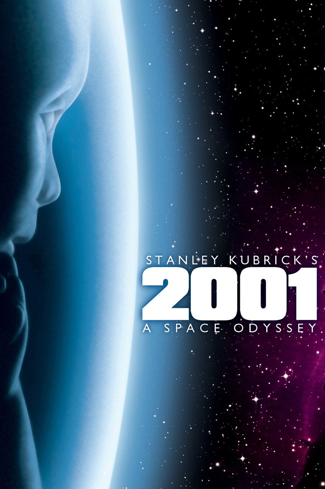

# NLP & Clustering -Movie Similarity from Plot Summaries

## Project Description

Natural Language Processing (NLP) is an exciting field of study for data scientists where they develop algorithms that can make sense out of conversational language used by humans. In this Project, you will use NLP to find the degree of similarity between movies based on their plots available on IMDb and Wikipedia.

## Dataset

The dataset contains the titles of the top 100 movies on [IMDb](https://www.imdb.com/) as well as each movie's plot summary from both IMDb and [Wikipedia](https://en.wikipedia.org/).

## Objective

To Find the top 3 similar movies within the same cluster.

## Tools and Libraries

- Tokenization and Lemmatization (Spacy)
- TF-IDF (scikit-learn)
- KMeans
- Cosine Similarity / Similarity Score
- Hierarchical Clustering (SciPy)
- Seaborn / Matplotlib
- Pandas
- Numpy